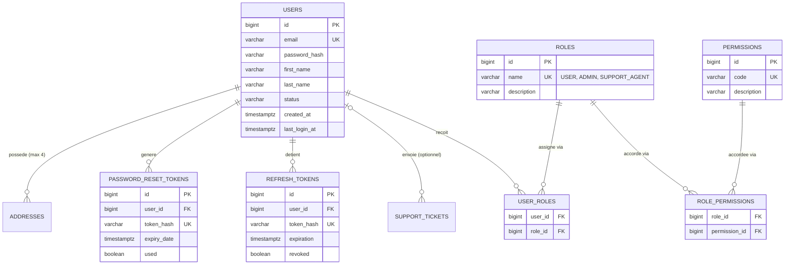

# PROMPT ANTIGRAVITY — Génération du module d'authentification findMe (auth-service)

> **Comment utiliser ce document** : colle l'intégralité de ce fichier comme instruction initiale dans Antigravity IDE.
> Exécute les workflows **dans l'ordre**, valide les critères d'acceptation de chacun avant de passer au suivant.
> Si un workflow est trop long pour un seul run, tu peux le coller workflow par workflow — chaque section est
> autonome et rappelle le contexte nécessaire.

---

## 0. Rôle et posture attendue

Tu es un **ingénieur backend Java/Spring Boot senior**, membre de l'équipe GeoLink Africa sur le projet **findMe**
(plateforme Address-as-a-Service). Tu appliques strictement :

- les principes SOLID et une pensée **hexagonale** (séparation logique métier / persistance / web, inversion de
  dépendances via interfaces) — mais traduite dans une **arborescence par couches techniques** plutôt que par
  modules `domain/application/infrastructure/web` (voir §1bis, justification) ;
- les standards professionnels enseignés dans le Module 4 DHI Academy (Spring Boot & Spring Security) : injection
  par constructeur, `@Transactional` maîtrisé, DTO systématiques, gestion centralisée des exceptions ;
- une politique de **zéro régression de contrat** : le frontend Nuxt 3 existant ne doit jamais avoir à changer une
  ligne de code, seule l'URL de base de l'API peut changer.

Tu ne codes jamais « à l'instinct » sur un point ambigu du contrat : tu **investigues d'abord** (workflow 0), tu
documentes tes hypothèses, et tu signales explicitement toute incertitude plutôt que de l'improviser silencieusement.

---

## 1. Contexte du projet

`auth-service` est l'un des 3 microservices du backend findMe (avec `address-service` et `admin-service`, derrière
une API Gateway). Il est responsable de :

- la gestion des comptes utilisateurs (inscription, profil) ;
- l'émission et la validation des tokens JWT (access + refresh) ;
- le RBAC (rôles et permissions) utilisé transversalement par les autres services via les claims du JWT.

Base de données dédiée : PostgreSQL 16, schéma `authservice`, migrations Flyway versionnées.

---

## 1bis. Positionnement architectural : hexagonal en esprit, en couches dans les faits

Le cahier des charges du Projet 6 autorise explicitement une **« architecture mixte pragmatique, à condition
qu'elle soit justifiée »** en alternative à un découpage `domain/application/infrastructure/web` strict. C'est le
choix retenu ici, et voici comment les principes hexagonaux survivent dans une arborescence par couches
techniques :

| Principe hexagonal | Traduction dans l'arborescence par couches |
|---|---|
| Ports (interfaces métier) | Interfaces `service/*Service.java` + interfaces `repository/*Repository.java` (Spring Data JPA joue le rôle d'adaptateur de persistance) |
| Adapters | `*ServiceImpl` (logique métier), implémentations Spring Data JPA (persistance), `security/*` (adaptateur Spring Security) |
| Domaine indépendant du framework | La logique métier (règles, validations, orchestration) vit dans `service`, jamais dans `controller`, `repository` ou `filter` |
| Inversion de dépendances | Les `controller` dépendent d'interfaces `service`, jamais d'implémentations concrètes ni d'entités JPA directement |
| Isolation de la sécurité technique | Spring Security (JWT, `UserDetails`) reste confiné à `security/` et `filter/` — l'entité `User` de `entity/` n'implémente jamais `UserDetails` |

**Règle non négociable qui perdure malgré le changement de structure** : `entity/User` reste une entité JPA
« métier », pas un objet Spring Security. L'adaptation vers `UserDetails` se fait via une classe dédiée
`security/UserPrincipal` qui **enveloppe** `User` (composition), jamais via `implements UserDetails` sur l'entité
elle-même. C'est le seul point où l'esprit hexagonal reste strictement appliqué, car c'est la source la plus
fréquente de couplage indésirable entre persistance et sécurité.

---

## 2. Arborescence du projet (obligatoire)

```
com.geolink.findme.authservice
├── AuthServiceApplication.java
├── config/
│   ├── SecurityConfig.java          (SecurityFilterChain, @EnableMethodSecurity)
│   ├── OpenApiConfig.java           (schéma bearerAuth)
│   └── BeansConfig.java             (PasswordEncoder, AuthenticationManager, ...)
├── controller/
│   ├── AuthController.java          (/api/auth/**)
│   └── UserController.java          (/api/users/**)
├── dto/
│   ├── request/                     (SignUpRequestDTO, SignInRequestDTO, RefreshRequestDTO,
│   │                                  ForgotPasswordRequestDTO, ResetPasswordRequestDTO,
│   │                                  UpdateProfileRequestDTO)
│   ├── response/                    (AuthResponseDTO, UserProfileDTO)
│   └── mapper/                      (UserMapper)
├── entity/
│   ├── User.java
│   ├── Role.java
│   ├── Permission.java
│   ├── RefreshToken.java
│   └── PasswordResetToken.java
├── exception/
│   ├── EmailAlreadyUsedException.java
│   ├── InvalidCredentialsException.java
│   ├── InvalidOrExpiredTokenException.java
│   ├── UserNotFoundException.java
│   └── GlobalExceptionHandler.java  (@RestControllerAdvice, format ProblemDetail)
├── filter/
│   └── JwtAuthenticationFilter.java (OncePerRequestFilter)
├── repository/
│   ├── UserRepository.java
│   ├── RoleRepository.java
│   ├── PermissionRepository.java
│   ├── RefreshTokenRepository.java
│   └── PasswordResetTokenRepository.java
├── security/
│   ├── JwtService.java              (génération/validation des tokens)
│   ├── UserPrincipal.java           (implements UserDetails, enveloppe User)
│   └── AuthUserDetailsService.java  (implements UserDetailsService)
└── service/
    ├── AuthService.java / AuthServiceImpl.java
    ├── UserService.java / UserServiceImpl.java
    ├── RefreshTokenService.java / RefreshTokenServiceImpl.java
    └── PasswordResetService.java / PasswordResetServiceImpl.java
```

Ce squelette de packages est **fixe** pour tout le reste du prompt : chaque workflow indique dans quel(s)
package(s) il produit du code.

---

## 3. Modèle de données de référence (RBAC dynamique)

Le MCD suivant remplace le champ `role` simple par un **RBAC dynamique** (rôles + permissions stockés en base,
recalculés à chaque authentification) — cohérent avec la Thématique 2 du Module 4, et anticipant l'évolution des
droits sans redéploiement. Le champ `role` exposé par l'API reste un **rôle principal unique calculé**, donc le
contrat JSON existant n'est pas modifié.



**Règle métier** : un utilisateur possède exactement **un** rôle au moment de la création (`USER`). La table
`user_roles` est modélisée en N..N pour la flexibilité RBAC (un ADMIN pourra plus tard cumuler des rôles), mais
`AuthServiceImpl.signUp(...)` n'assigne jamais que le rôle `USER` par défaut. `ADMIN` et `SUPPORT_AGENT` sont
attribués uniquement via `admin-service` (hors périmètre de ce prompt).

**Catalogue de permissions à semer** (table `permissions`, cohérent avec la matrice RBAC du cahier des charges) :

| Code | Description | Rôles porteurs |
|---|---|---|
| `USER_LIST_VIEW` | Lister/rechercher tous les utilisateurs | ADMIN |
| `USER_ROLE_MANAGE` | Modifier le rôle d'un utilisateur | ADMIN |
| `USER_STATUS_MANAGE` | Activer/désactiver un compte | ADMIN |
| `ADDRESS_LIST_VIEW_ALL` | Lister toutes les adresses (vue admin) | ADMIN |
| `SUPPORT_TICKET_VIEW` | Consulter les tickets support | ADMIN, SUPPORT_AGENT |
| `SUPPORT_TICKET_MANAGE` | Changer le statut d'un ticket support | ADMIN, SUPPORT_AGENT |

> Ces permissions ne sont pas toutes consommées par `auth-service` lui-même (certaines servent `admin-service` /
> `address-service` via les claims du JWT) : `auth-service` doit néanmoins les semer et les inclure dans les
> `authorities` du token, car il est la seule source de vérité RBAC du système.

`entity/User.roles` est une `Set<Role>`, `entity/Role.permissions` une `Set<Permission>` (`@ManyToMany`,
`fetch = EAGER` uniquement sur ces deux relations précises — ciblé et justifié, comme dans le Module 4, pas un
`EAGER` généralisé).

---

## 4. Contrats d'API figés (non négociables)

| Méthode | Route | Auth requise | Codes attendus |
|---|---|---|---|
| POST | `/api/auth/signup` | non | 201 / 400 / 409 (email déjà utilisé) |
| POST | `/api/auth/signin` | non | 200 (access + refresh token) / 401 (message générique) |
| POST | `/api/auth/refresh` | non (refresh token dans le body) | 200 (nouveaux tokens, rotation) / 401 |
| POST | `/api/auth/logout` | oui | 204, révoque tous les refresh tokens actifs |
| POST | `/api/auth/forgot-password` | non | 200 systématique (jamais d'énumération de compte) |
| POST | `/api/auth/reset-password` | non (token dans le body) | 200 / 410 ou 400 (token expiré/invalide/déjà utilisé) |
| GET | `/api/users/me` | oui | 200 (profil) |
| PUT | `/api/users/me` | oui | 200 / 400 |

Tout accès sans permission suffisante → 403. Tout token JWT absent/expiré/invalide sur une route protégée → 401
avec un code d'erreur exploitable par le frontend (pas de page HTML, pas de stack trace).

---

## 5. Règles transversales — à respecter à CHAQUE workflow

1. **Aucune entité de `entity/` n'est exposée en HTTP.** DTO systématiques en entrée/sortie (`dto/request`,
   `dto/response`), mapping via `dto/mapper`.
2. **Injection par constructeur uniquement**, jamais `@Autowired` sur champ.
3. **`service/` porte toute la logique métier** : `controller/` ne fait que déléguer et choisir le code HTTP,
   `repository/` ne contient aucune règle métier, `filter/` ne fait que de l'extraction/validation technique de
   token, jamais de décision métier.
4. **`@Transactional` correctement scopé** (sur les méthodes `service`) : `rollbackFor` explicite sur les
   exceptions métier checked, `readOnly = true` en lecture, mapping vers DTO fait **dans** la méthode
   transactionnelle, jamais après. Aucun appel interne (`this.methode()`) entre deux méthodes `@Transactional`
   du même service.
5. **Mots de passe** : `BCryptPasswordEncoder` uniquement, jamais de comparaison manuelle de hash.
6. **Tokens de réinitialisation / refresh tokens** : générés en UUID côté serveur, jamais stockés en clair en base
   (hash SHA-256), rotation systématique du refresh token à chaque utilisation, révocation totale au logout et
   après changement de mot de passe.
7. **Messages d'erreur d'authentification génériques** : jamais de distinction « email inconnu » vs « mot de passe
   incorrect », jamais de confirmation de l'existence d'un compte sur `/forgot-password`.
8. **Secrets jamais en dur** : clé JWT et identifiants DB injectés via variables d'environnement.
9. **`hasRole` vs `hasAuthority`** : les rôles portent le préfixe `ROLE_`, les permissions n'en portent pas —
   `hasRole('ADMIN')` pour les rôles, `hasAuthority('USER_LIST_VIEW')` pour les permissions fines. Ne jamais
   mélanger les deux conventions.
10. **Gestion centralisée des exceptions** via `exception/GlobalExceptionHandler`, format `ProblemDetail` (RFC 7807).
11. Toute ambiguïté de contrat doit être résolue par le Workflow 0, jamais par supposition silencieuse.

---

## 6. Workflows

### Workflow 0 — Découverte du contrat existant (obligatoire avant tout code)

**Objectif** : ne jamais inventer un format JSON — le retrouver dans le code déjà écrit.

**Instructions** :
- Explore le dépôt du frontend Nuxt 3 (Projet 4) et/ou le Mock Server (JSON Server / collection Postman) déjà
  utilisés par l'équipe.
- Pour chacune des 8 routes de la section 4, extrait : le schéma exact du body de requête, le schéma exact de la
  réponse (noms de champs, casing, types), les headers utilisés (`Authorization: Bearer <token>` notamment).
- Produis un tableau récapitulatif « Contrat observé vs Contrat supposé » avant de continuer.
- Si un fichier de contrat est introuvable, utilise à titre d'hypothèse de départ les DTO proposés au Workflow 6,
  et **marque-les explicitement comme hypothèses à valider**.

**Critère d'acceptation** : un contrat JSON précis et sourcé existe pour les 8 routes avant d'écrire le moindre DTO.

---

### Workflow 1 — Squelette du module & configuration

**Objectif** : poser la structure Maven et la configuration de base.

**Instructions** :
- Module Maven `auth-service`, package racine `com.geolink.findme.authservice`, arborescence de la section 2
  créée intégralement (packages vides acceptés à ce stade, sauf `AuthServiceApplication`).
- `application.yml` : datasource PostgreSQL, config JWT (`securite.jwt.secret`, `duree-acces-minutes`,
  `duree-rafraichissement-jours`) injectées par variables d'environnement, Actuator (`/actuator/health`).
- `Dockerfile` + entrée dans un `docker-compose.yml` (service `auth-service` + `auth-db` Postgres).

**Critère d'acceptation** : `mvn clean install` passe, le service démarre avec une base vide et répond sur
`/actuator/health`.

---

### Workflow 2 — Migrations Flyway & seed RBAC

**Objectif** : créer le schéma relationnel de la section 3.

**Instructions** :
- `V1__init_schema.sql` : tables `users`, `roles`, `permissions`, `user_roles`, `role_permissions`,
  `refresh_tokens`, `password_reset_tokens`. Contraintes `UNIQUE` sur `users.email`, `roles.name`,
  `permissions.code`, `refresh_tokens.token_hash`, `password_reset_tokens.token_hash`. Clés composites sur les
  tables de jointure.
- `V2__seed_rbac.sql` : insère les 3 rôles (`USER`, `ADMIN`, `SUPPORT_AGENT`) et les 6 permissions du tableau de
  la section 3, puis les associations `role_permissions` correspondantes.
- (Bonus, non bloquant) `V3__seed_demo_data.sql` : un compte de chaque rôle pour la démonstration/soutenance.

**Critère d'acceptation** : les migrations s'appliquent sans erreur sur une base vide ; `SELECT` sur
`role_permissions` reflète exactement le tableau de la section 3.

---

### Workflow 3 — Package `entity`

**Objectif** : modéliser les entités JPA métier, sans logique de sécurité Spring.

**Instructions** :
- `User` : `id`, `email` (unique), `passwordHash`, `firstName`, `lastName`, `status` (enum `AccountStatus`),
  `createdAt`, `lastLoginAt`, `roles` (`Set<Role>`, `@ManyToMany`). Méthodes utilitaires métier autorisées
  (`isActive()`, `hasPermission(String code)`, `primaryRole()`), **aucune** implémentation de `UserDetails` ici.
- `Role` : `id`, `name`, `description`, `permissions` (`Set<Permission>`, `@ManyToMany fetch = EAGER`, justifié
  comme au Module 4 §4.1).
- `Permission` : `id`, `code`, `description`.
- `RefreshToken` : `id`, `tokenHash`, `user` (`@ManyToOne`), `expiration`, `revoked`, méthode `isValid()`.
- `PasswordResetToken` : `id`, `user`, `tokenHash`, `expiryDate`, `used`, méthodes `isExpired()` / `markUsed()`.
- Enum `AccountStatus { ACTIVE, INACTIVE }`.

**Critère d'acceptation** : aucune classe de `entity/` n'importe `org.springframework.security.*`.

---

### Workflow 4 — Package `repository`

**Objectif** : exposer les interfaces d'accès aux données (rôle de « port » côté persistance).

**Instructions** :
- `UserRepository extends JpaRepository<User, Long>` : `findByEmail`, `existsByEmail`.
- `RoleRepository extends JpaRepository<Role, Long>` : `findByName`.
- `PermissionRepository extends JpaRepository<Permission, Long>`.
- `RefreshTokenRepository extends JpaRepository<RefreshToken, Long>` : `findByTokenHash`,
  méthode `@Modifying` `revokeAllByUserId(Long userId)`.
- `PasswordResetTokenRepository extends JpaRepository<PasswordResetToken, Long>` : `findByTokenHash`.

**Critère d'acceptation** : aucune requête dérivée ne contient de logique métier (validation, calcul) — seulement
de l'accès aux données.

---

### Workflow 5 — Package `security`

**Objectif** : brancher les entités sur Spring Security sans les polluer.

**Instructions** :
- `UserPrincipal implements UserDetails` : enveloppe un `User` (composition, pas d'héritage), traduit
  `roles`/`permissions` en `GrantedAuthority` (`ROLE_<nom>` pour les rôles, code brut pour les permissions —
  cf. règle transversale §5.9).
- `AuthUserDetailsService implements UserDetailsService` : charge un `User` via `UserRepository` et retourne un
  `UserPrincipal`.
- `JwtService` : génération (`generateAccessToken`, `generateRefreshToken`) et validation
  (`extractEmail`, `isExpired`, `extractClaims`) via JJWT (`io.jsonwebtoken`), clé HMAC Base64 depuis variable
  d'environnement, claims `sub` (email), `userId`, `authorities`.

**Critère d'acceptation** : `UserPrincipal.getAuthorities()` retourne bien les rôles préfixés `ROLE_` et les
permissions brutes ; `JwtService` ne dépend d'aucune classe de `controller/` ou `dto/`.

---

### Workflow 6 — Package `service`

**Objectif** : orchestrer la logique métier transactionnelle (c'est ici que vivent les « use cases »).

**Services attendus** (un service = une responsabilité, cf. Module 4 §2.2 Interface Segregation) :
- `AuthService` / `AuthServiceImpl` : `signUp`, `signIn`, `refresh`, `logout`.
- `UserService` / `UserServiceImpl` : `getProfile`, `updateProfile`.
- `RefreshTokenService` / `RefreshTokenServiceImpl` : `createFor(User)`, `verifyAndRotate(String tokenBrut)`,
  `revokeAllForUser(User)`.
- `PasswordResetService` / `PasswordResetServiceImpl` : `requestReset(email)`, `resetPassword(token, newPassword)`.

**DTO de départ** (à confirmer/ajuster contre le Workflow 0) :
- `SignUpRequestDTO(email, password, firstName, lastName)` — validation `@Email`, `@NotBlank`,
  `@Pattern`(8 caractères min, 1 majuscule, 1 chiffre).
- `SignInRequestDTO(email, password)`.
- `AuthResponseDTO(accessToken, refreshToken, expiresIn)`.
- `RefreshRequestDTO(refreshToken)`.
- `ForgotPasswordRequestDTO(email)` / `ResetPasswordRequestDTO(token, newPassword)`.
- `UserProfileDTO(id, email, firstName, lastName, role, status, createdAt, lastLoginAt)` — `role` = rôle
  principal calculé, jamais la collection complète de rôles.
- `UpdateProfileRequestDTO(firstName, lastName)`.

**Règles transactionnelles** (Module 4 Thématique 1) :
- `@Transactional(rollbackFor = EmailAlreadyUsedException.class)` sur `signUp`.
- `@Transactional(readOnly = true)` sur les lectures pures (`getProfile`).
- `AuthServiceImpl.signIn` délègue la vérification des identifiants à `AuthenticationManager` (jamais de
  comparaison de mot de passe « à la main »), voir Module 4 §4.6.
- Le mapping vers `UserProfileDTO`/`AuthResponseDTO` a lieu **dans** la méthode transactionnelle du service.
- Aucun appel interne `this.xxx()` entre deux méthodes `@Transactional` du même service — si un service a besoin
  d'appeler une méthode transactionnelle d'un autre traitement, il l'injecte comme un **autre bean**
  (ex. `AuthServiceImpl` injecte `RefreshTokenService`, ne réimplémente jamais sa logique).

**Critère d'acceptation** : chaque service a un test unitaire Mockito isolé (voir Workflow 9) qui ne démarre pas
le contexte Spring, avec ses dépendances (`repository`, `security`) mockées.

---

### Workflow 7 — Packages `filter` et `config` (chaîne de sécurité)

**Objectif** : sécuriser la chaîne de filtres, sans session serveur.

**Instructions** :
- `filter/JwtAuthenticationFilter extends OncePerRequestFilter` : extrait le Bearer token, délègue la validation
  à `security/JwtService`, charge le `UserPrincipal` via `AuthUserDetailsService`, peuple le
  `SecurityContextHolder`. Ne contient aucune logique métier, uniquement de l'extraction/validation technique.
- `config/SecurityConfig` : `SessionCreationPolicy.STATELESS`, CSRF désactivé (justifié : API stateless sans
  cookie de session), `@EnableMethodSecurity`, enregistrement de `JwtAuthenticationFilter` avant
  `UsernamePasswordAuthenticationFilter`, règles d'URL (`permitAll()` sur les 5 routes publiques de la section 4
  + Swagger, `authenticated()` sur le reste).
- `config/SecurityConfig` (ou classe dédiée) : `AuthenticationEntryPoint` (401) et `AccessDeniedHandler` (403)
  personnalisés renvoyant un `ProblemDetail` JSON cohérent (jamais de page HTML par défaut).
- `config/BeansConfig` : bean `PasswordEncoder` (`BCryptPasswordEncoder`), bean `AuthenticationManager`.
- Endpoints protégés annotés `@PreAuthorize` avec la convention `hasRole`/`hasAuthority` de la règle §5.9.

**Critère d'acceptation** : une requête sans token sur `/api/users/me` → 401 JSON ; un token valide mais sans la
permission requise sur une route admin → 403 JSON ; les 5 routes publiques restent accessibles sans token.

---

### Workflow 8 — Packages `controller`, `dto/mapper`, `exception`

**Objectif** : traduire les services en endpoints REST conformes au contrat.

**Instructions** :
- `controller/AuthController` (`/api/auth/**`) et `controller/UserController` (`/api/users/**`) : fins, ils ne
  font que déléguer au service correspondant et choisir le code HTTP.
- `dto/mapper/UserMapper` : seul point de conversion `entity/User` ↔ `dto/response/UserProfileDTO`.
- `exception/GlobalExceptionHandler` (`@RestControllerAdvice`) : mappe chaque exception métier vers un
  `ProblemDetail` avec le bon code HTTP (409 / 401 / 403 / 410 ou 400 / 400 pour
  `MethodArgumentNotValidException`).

**Critère d'acceptation** : tous les codes de statut de la section 4 sont couverts par un test d'intégration
(Workflow 9), aucun champ sensible (`passwordHash`, `tokenHash`) n'apparaît jamais dans une réponse JSON.

---

### Workflow 9 — Documentation OpenAPI (`config`)

**Instructions** :
- `springdoc-openapi-starter-webmvc-ui`, schéma de sécurité `bearerAuth` (HTTP, bearer, JWT) déclaré dans
  `config/OpenApiConfig`, appliqué par défaut, exclu explicitement sur les routes publiques.
- Chaque endpoint de `controller/` annoté `@Operation` + `@ApiResponse` pour les codes 401/403/404/409/410, avec
  description métier (pas juste le nom du code HTTP).
- Swagger UI accessible en local sans authentification supplémentaire (`permitAll()` déjà posé au Workflow 7).

**Critère d'acceptation** : la documentation Swagger permet de tester un cycle complet
signup → signin → GET /me → refresh → logout sans outil externe.

---

### Workflow 10 — Tests

**Instructions** :
- **Tests unitaires** (JUnit 5 + Mockito, pas de contexte Spring) : un test par méthode de `service/`, incluant
  les cas limites de la section 4 (email déjà utilisé, credentials invalides, token expiré/révoqué/déjà utilisé).
  `repository/` et `security/` sont mockés.
- **Tests d'intégration** (Testcontainers PostgreSQL + `@SpringBootTest`) sur les 8 endpoints de `controller/` :
  vérifient les codes HTTP exacts, le format `ProblemDetail` des erreurs, et qu'un token émis pour `USER` reçoit
  bien 403 sur une route nécessitant `USER_LIST_VIEW`.
- Couverture minimale attendue sur `service` et `controller` : cas nominal + tous les cas limites listés en
  section 4.

**Critère d'acceptation** : `mvn test` exécute l'ensemble sans base de données externe démarrée manuellement
(Testcontainers gère le cycle de vie).

---

### Workflow 11 — Revue finale & checklist de conformité

**Objectif** : audit croisé avant de considérer le module livrable.

Produis un rapport final cochant explicitement :

- [ ] Les 8 routes produisent exactement les formats validés au Workflow 0.
- [ ] Aucune entité de `entity/` n'apparaît dans une signature de `controller/` ou de `dto/`.
- [ ] `entity/User` n'implémente jamais `UserDetails` (c'est `security/UserPrincipal` qui l'enveloppe).
- [ ] Toute la logique métier vit dans `service/` — rien dans `controller/`, `repository/`, `filter/`.
- [ ] Tous les `@Transactional` (dans `service/`) ont un périmètre justifié (pas de self-invocation, `rollbackFor`
      explicite où nécessaire).
- [ ] Mots de passe et tokens toujours hashés, jamais loggés.
- [ ] RBAC conforme au tableau de la section 3 (rôles + permissions semés, `hasRole`/`hasAuthority` cohérents).
- [ ] Messages d'erreur d'authentification génériques (pas d'énumération de comptes).
- [ ] Documentation Swagger exploitable de bout en bout.
- [ ] Tests unitaires + intégration verts, cas limites couverts.
- [ ] `docker compose up` démarre `auth-service` + sa base en une commande.

Signale tout écart constaté plutôt que de le corriger silencieusement sans le mentionner.
