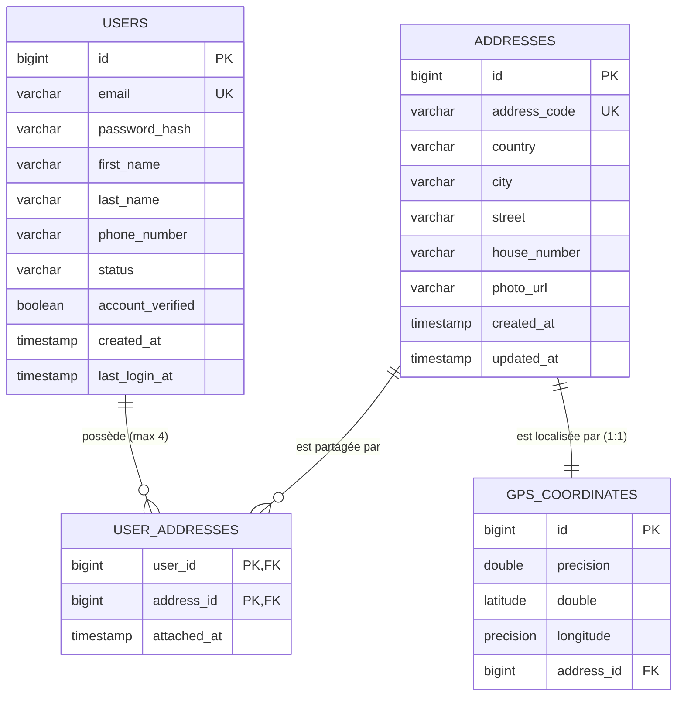
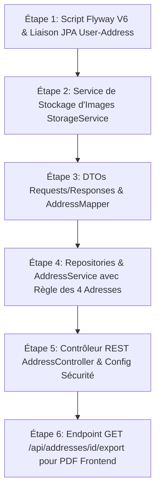

# Plan d'Implémentation - Module de Gestion des Adresses (`findme`)

Ce document présente le plan d'architecture et d'implémentation mis à jour pour le module de gestion des adresses du projet **findMe** en Spring Boot.

---

## 1. Bilan de la Tâche 1 (Refactoring des Packages)

La **Tâche 1** a été exécutée avec succès :
- L'ensemble du code Java a été déplacé du sous-package `com.geolink.findme.authservice` vers le package racine **`com.geolink.findme`**.
- Arborescence des packages mise à jour :
  - `com.geolink.findme.config`
  - `com.geolink.findme.controller`
  - `com.geolink.findme.dto`
  - `com.geolink.findme.entity`
  - `com.geolink.findme.exception`
  - `com.geolink.findme.filter`
  - `com.geolink.findme.repository`
  - `com.geolink.findme.security`
  - `com.geolink.findme.service`

---

## 2. Prise en compte de la Tâche 2 : Entité `User` existante & Relation `Address`

L'entité **`User`** (`com.geolink.findme.entity.User`) et sa table PostgreSQL correspondante `users` existent déjà avec tous leurs attributs et fonctionnalités :
- Attributs existants : `id`, `email`, `passwordHash`, `firstName`, `lastName`, `phoneNumber`, `status`, `accountVerified`, `createdAt`, `lastLoginAt`, `roles`.
- **Relation N:M (`@ManyToMany`) avec `Address`** :
  - Un utilisateur possède entre **0 et 4 adresses** (blocage à 4 adresses maximum au niveau de la couche de service `AddressService`).
  - Une même adresse physique peut être partagée par plusieurs utilisateurs (ex: colocation).
  - La relation est matérialisée par la table de jonction `user_addresses (user_id, address_id)`.

- **Relation 1:1 (`@OneToOne`) entre `Address` et `GpsCoordinate`** :
  - Chaque adresse est associée à une coordonnée GPS unique (latitude, longitude).



---

## 3. Stockage des Photos (Conforme au Projet 6)

- Interface d'abstraction `StorageService` (`store`, `delete`, `loadAsResource`).
- Implémentation locale `LocalStorageServiceImpl` avec enregistrement sous `/var/findme/uploads/addresses/` (ou volume Docker).
- Validation des types MIME (`image/jpeg`, `image/png`, `image/webp`) et de la taille maximale (5 Mo).
- Fichiers exposés via une URL publique `/api/files/addresses/{filename}`.

---

## 4. Endpoints REST Exposés au Niveau du Contrôleur (`AddressController`)

| Méthode | Endpoint | Description | Code Succès | Erreurs Possibles |
| :--- | :--- | :--- | :--- | :--- |
| **GET** | `/api/addresses` | Liste paginée, triée et filtrable des adresses de l'utilisateur connecté | `200 OK` | `401 Unauthorized` |
| **POST** | `/api/addresses` | Création d'une adresse (attribution d'un `addressCode` + vérification stricte max 4 adresses) | `201 Created` | `400 Bad Request`, `409 Conflict` (quota atteint) |
| **GET** | `/api/addresses/{id}` | Détail d'une adresse de l'utilisateur connecté | `200 OK` | `403 Forbidden`, `404 Not Found` |
| **PUT** | `/api/addresses/{id}` | Modification d'une adresse | `200 OK` | `400 Bad Request`, `403 Forbidden`, `404 Not Found` |
| **DELETE** | `/api/addresses/{id}` | Invalidation/Suppression du lien d'adresse | `204 No Content` | `403 Forbidden`, `404 Not Found` |
| **POST** | `/api/addresses/{id}/photo` | Upload / remplacement de la photo associée (`multipart/form-data`) | `200 OK` | `400 Bad Request`, `403 Forbidden` |
| **GET** | `/api/addresses/{id}/export` | Données formatées JSON pour la génération du PDF côté frontend (données user, adresse, `addressCode`, GPS) | `200 OK` | `403 Forbidden`, `404 Not Found` |

---

## 5. Paylod JSON pour la Génération PDF Frontend (`GET /api/addresses/{id}/export`)

Puisque la génération du PDF **et du QR Code** s'effectue au niveau du **frontend (Nuxt 3)**, l'endpoint retourne le DTO JSON structuré suivant :

```json
{
  "addressId": 12,
  "addressCode": "ADR-2026-X89K",
  "user": {
    "fullName": "Lionel MBARGA",
    "email": "lionel.mbarga@geolink.com",
    "phoneNumber": "+237697979321"
  },
  "formattedAddress": "124 Rue Akwa, Douala, Cameroun",
  "country": "Cameroun",
  "city": "Douala",
  "street": "Rue Akwa",
  "houseNumber": "124",
  "gps": {
    "latitude": 4.051056,
    "longitude": 9.708532
  },
  "photoUrl": "http://localhost:8080/api/files/addresses/a1b2c3d4-photo.jpg",
  "generatedAt": "2026-08-19T10:00:00Z"
}
```

---

## 6. Plan d'Implémentation Étape par Étape

Chaque étape est indépendante et doit être validable avant de passer à la suivante. *(Aucun test unitaire, d'intégration ou E2E ne sera écrit).*



### Étape 1 : Script Flyway V6 & Liaison JPA avec l'Entité `User` existante
- **Description** :
  - Créer la migration Flyway `V6__create_addresses_and_gps_tables.sql` :
    - Table `gps_coordinates` (id, latitude, longitude, address_id).
    - Table `addresses` (id, address_code UNIQUE, country, city, street, house_number, photo_url, created_at, updated_at).
    - Table de jonction `user_addresses (user_id REFERENCES users(id), address_id REFERENCES addresses(id))`.
  - Créer l'entité JPA `Address` et `GpsCoordinate` dans `com.geolink.findme.entity`.
  - Modifier l'entité existante `User` (`com.geolink.findme.entity.User`) pour lui ajouter le champ `@ManyToMany Set<Address> addresses`.
- **Validation Étape 1** : Exécution de la migration PostgreSQL et confirmation de la présence des tables et contraintes de clés étrangères.

---

### Étape 2 : Service de Stockage d'Images (`StorageService`)
- **Description** :
  - Créer l'interface `StorageService` et son implémentation `LocalStorageServiceImpl` sous `com.geolink.findme.service`.
  - Configurer l'exposition du dossier d'upload via `WebMvcConfigurer` ou un contrôleur `FileController` pour servir l'image via `/api/files/addresses/{filename}`.
- **Validation Étape 2** : Test de téléversement et vérification de la lisibilité du fichier image sur l'URL publique.

---

### Étape 3 : DTOs & Mapper (`AddressMapper`)
- **Description** :
  - Créer les DTOs :
    - `AddressCreateRequestDTO`
    - `AddressUpdateRequestDTO`
    - `AddressResponseDTO` (incluant `addressCode`, `gps`, `photoUrl`, etc.)
    - `UserPdfExportDTO` (`fullName`, `email`, `phoneNumber`)
    - `AddressExportDTO`
  - Créer le mapper `AddressMapper` pour la conversion entre entités et DTOs.
- **Validation Étape 3** : Vérification de la structure des objets et compilation sans erreur.

---

### Étape 4 : Couche Repository & Service Métier (`AddressServiceImpl`)
- **Description** :
  - Créer `AddressRepository` et `GpsCoordinateRepository` sous `com.geolink.findme.repository`.
  - Créer `AddressService` et `AddressServiceImpl` sous `com.geolink.findme.service` :
    - Génération automatique et garantie d'unicité du `addressCode`.
    - Implémentation du contrôle du quota : levée de `MaxAddressLimitExceededException` (HTTP 409) si `count >= 4`.
    - Contrôle de propriété systématique (`ForbiddenAccessException` HTTP 403).
    - Pagination, tri et filtres dynamiques (pays, ville, quartier, rue).
- **Validation Étape 4** : Validation métier du blocage à 4 adresses et de la création avec `addressCode`.

---

### Étape 5 : Contrôleur REST (`AddressController`) & Configuration Sécurité
- **Description** :
  - Créer `AddressController` sous `com.geolink.findme.controller` avec les routes :
    - `GET /api/addresses`
    - `POST /api/addresses`
    - `GET /api/addresses/{id}`
    - `PUT /api/addresses/{id}`
    - `DELETE /api/addresses/{id}`
    - `POST /api/addresses/{id}/photo`
  - Extraire l'utilisateur connecté depuis le token JWT (`@AuthenticationPrincipal UserPrincipal`).
  - Mettre à jour `SecurityConfig` (`com.geolink.findme.config.SecurityConfig`) pour autoriser/sécuriser la ressource.
- **Validation Étape 5** : Vérification de l'exposition et des réponses REST HTTP.

---

### Étape 6 : Endpoint d'Exportation PDF (`GET /api/addresses/{id}/export`)
- **Description** :
  - Implémenter la méthode d'exportation dans `AddressServiceImpl` et `AddressController`.
  - Construire le DTO `AddressExportDTO` réunissant le `addressCode`, les champs de l'adresse, les coordonnées GPS, la photo, et les détails utilisateur (`fullName`, `email`, `phoneNumber`).
- **Validation Étape 6** : Validation de la réponse JSON au format attendu par le frontend Nuxt 3.

---

## 7. Arborescence du Code Source (`com.geolink.findme`)

```
src/main/java/com/geolink/findme/
├── config/
│   ├── SecurityConfig.java
│   └── StorageConfig.java
├── controller/
│   ├── AddressController.java
│   ├── AuthController.java
│   ├── FileController.java
│   └── UserController.java
├── dto/
│   ├── request/
│   │   ├── AddressCreateRequestDTO.java
│   │   └── AddressUpdateRequestDTO.java
│   └── response/
│       ├── AddressResponseDTO.java
│       ├── AddressExportDTO.java
│       └── UserPdfExportDTO.java
├── entity/
│   ├── User.java (existant, lié @ManyToMany avec Address)
│   ├── Address.java (nouveau)
│   └── GpsCoordinate.java (nouveau)
├── exception/
│   ├── MaxAddressLimitExceededException.java
│   └── GlobalExceptionHandler.java
├── repository/
│   ├── UserRepository.java (existant)
│   ├── AddressRepository.java (nouveau)
│   └── GpsCoordinateRepository.java (nouveau)
└── service/
    ├── AddressService.java
    ├── AddressServiceImpl.java
    ├── StorageService.java
    └── LocalStorageServiceImpl.java
```

---

## Informations Requises avant Validation

1. Validez-vous ce plan d'implémentation révisé, basé sur le package `com.geolink.findme` et liant la table `User` existante à `Address` ?
2. Souhaitez-vous que nous commencions l'**Étape 1 (Migration Flyway V6 & Entités JPA)** ?
